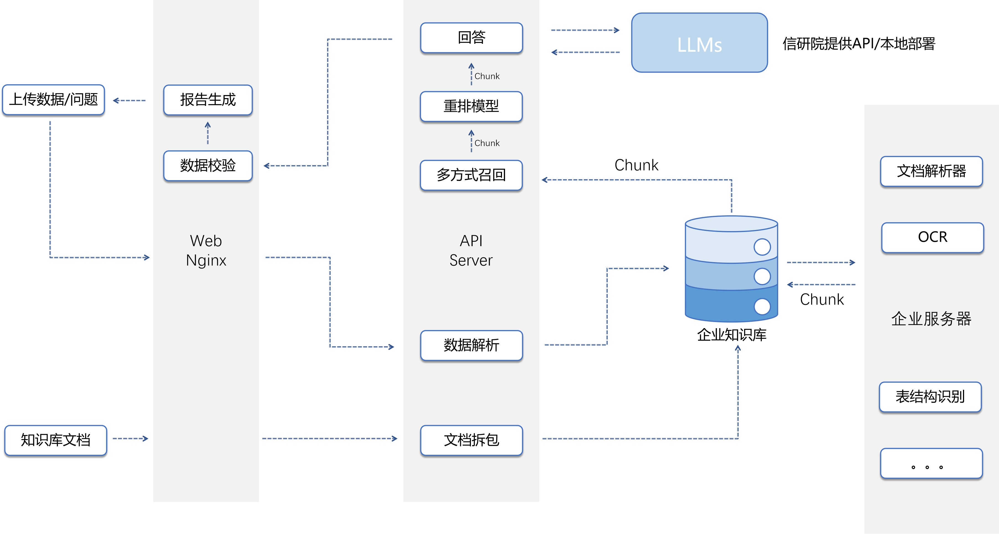

# ZHONGYI_Test - 文档处理平台

基于Vue 3 + TypeScript + Vite构建的文档处理前端应用，对接后端ragflow工作流，提供Excel/Word文件处理、导出和OCR功能。

## 功能特性

- Excel文件上传、处理和导出 (支持.xlsx格式)
- Word文档生成和导出 (基于docx库)
- 百度OCR文字识别功能
- 基于Element Plus的UI界面
- 支持Excel模板导出
- Word报告自动生成

## 演示视频

[](https://www.bilibili.com/video/BV1Aj8DzzEHd/)

## 项目结构

```
src/
├── components/            # 可复用组件
│   ├── BReportExporters/  # Excel导出相关组件
│   ├── CReportExporters/  # Word导出相关组件
│   └── UploadHandlers/    # 文件上传处理组件
├── composables/           # 组合式函数
├── stores/                # Pinia状态管理
├── utils/                 # 工具函数
│   └── CReportExporters/  # 文档处理核心逻辑
├── views/                 # 页面视图
│   ├── DetectTab.vue      # 检测功能页(OCR处理)
│   ├── GenerateTab.vue    # 生成功能页(报告生成)
│   ├── HomeView.vue       # 主页
│   └── LoginView.vue      # 登录页
```

## 技术栈

- Vue 3 + TypeScript
- Vite构建工具
- Pinia状态管理
- Element Plus UI框架
- Vitest单元测试
- Cypress端到端测试

## 系统架构

<div align="center" style="margin-top:20px;margin-bottom:20px;">

</div>

## 核心依赖

- `docx`: Word文档生成
- `exceljs`: Excel文件处理  
- `xlsx`: Excel文件解析
- `element-plus`: UI组件库
- `pinia`: 状态管理
- `axios`: HTTP请求
- `vue-router`: 路由管理

## 开发环境配置

1. 复制示例配置文件：
   ```bash
   cp .env.example .env
   ```
2. 编辑 .env 文件，填入实际的配置值：
   ```env
   VITE_API_BASE_URL=http://your-api-server
   VITE_OCR_APP_ID=your-baidu-ocr-appid
   VITE_OCR_API_KEY=your-baidu-ocr-apikey
   VITE_OCR_SECRET_KEY=your-baidu-ocr-secretkey
   ...
   ```

3. 确保 .env 文件不会被提交到版本控制

### 开发注意事项

- Excel处理使用exceljs库，支持.xlsx格式
- Word报告生成使用docx库
- OCR功能对接百度OCR API，需要申请相关密钥
- 组件命名遵循BReport(Excel相关)/CReport(Word相关)前缀规范

## 项目设置

```sh
npm install
```

### 开发模式

```sh
npm run dev
```

### 生产构建

```sh
npm run build
```

## 自定义配置

参考[Vite配置文档](https://vite.dev/config/)
